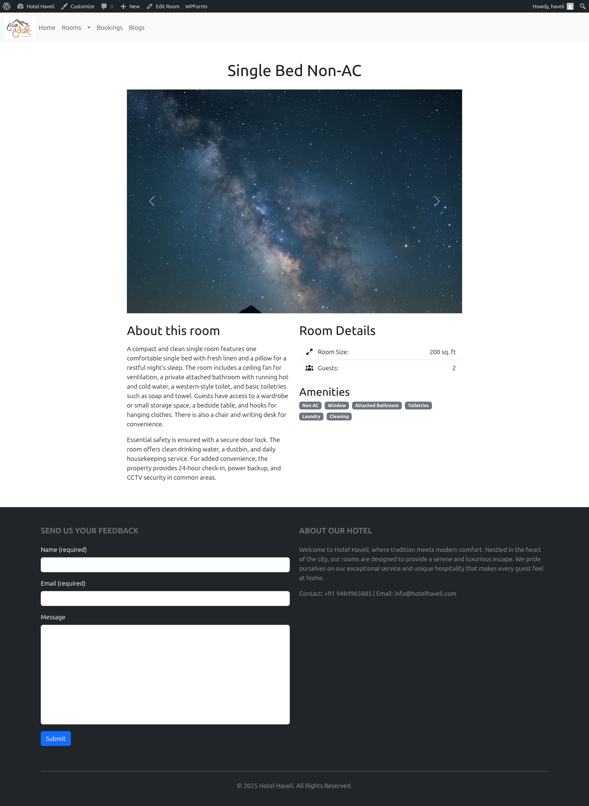

# Ritestay – Custom WordPress Theme

Ritestay is a clean, minimal custom WordPress theme designed and developed from scratch for learning and demonstration purposes. Built with a focus on real-world hospitality and local business use-cases, this theme is fully responsive, uses the Bootstrap grid system, supports custom menus (including multi-level dropdowns), and is ready for further extension (bookings, custom post types, more).

## Features

- Custom navigation menu with multi-level dropdown support (Rooms submenu).
- Responsive design: seamless experience on both desktop and mobile devices.
- Admin-driven dynamic page creation and linking.
- Blog posts displayed in a Bootstrap-powered grid for easy, modern browsing.
- Dynamic about and feedback form at footer section.
- Rooms cards displayed in a Bootstrap-powered grid.
- Custom Post Type: Rooms and its data can be accessed through 'ritestay core' plugin
- Room type and individual room permalinks will be generated dynamically through 'ritestay core' CPT.
- Minimal, clean appearance—ideal for business, hotel, or portfolio sites.
- Screenshots provided below demonstrate desktop and mobile views.

## Screenshots

### Desktop View

Desktop screenshots show the custom menu (with dropdown), logo placement, search box, and multi-column blog grid.

### Mobile View

Mobile screenshots highlight fully responsive navigation and layout (hamburger menu, vertical stacking).

## In Progress

Ritestay is a work in progress. Planned features in the next weeks:

- Hotel-specific functionality (booking engine integration, room management).
- Further meta data integration in Rooms CPT
- Visual/design enhancements.
- Improved accessibility and performance.
- Documentation for installation and customization.

## How to Use

1. Clone or download the repo into your `/wp-content/themes/` directory.
2. Activate the Ritestay theme from your WordPress admin panel.
3. Create pages (Home, Rooms, Bookings, Blogs) and assign them to the main menu.
4. Enjoy a lightweight, extendable starter WordPress theme fit for guesthouses.
5. Download and install 'ritestay core' and 'contact form 7' plugins

## About the Developer

Ritestay was built as part of my growing portfolio in WordPress theme development. I design and develop custom themes with a focus on clean code, responsive layouts, and practical business use-cases. My goal is to help businesses and individuals showcase their services online with lightweight, extendable WordPress solutions.

I’m actively taking on freelance projects through platforms like Upwork, Fiverr, and Truelancer, as well as direct client collaborations. This theme demonstrates my ability to create from scratch, customize for real needs, and continue improving based on feedback and evolving requirements.
