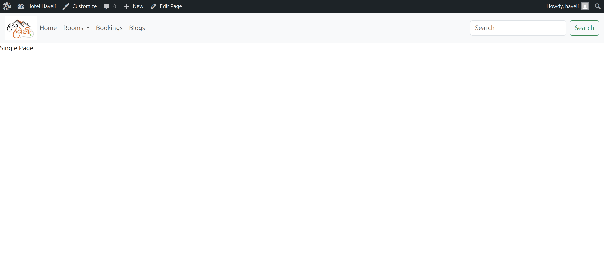

# Ritestay – Custom WordPress Theme

Ritestay is a clean, minimal custom WordPress theme designed and developed from scratch for learning and demonstration purposes. Built with a focus on real-world hospitality and local business use-cases, this theme is fully responsive, uses the Bootstrap grid system, supports custom menus (including multi-level dropdowns), and is ready for further extension (bookings, custom post types, more).

## Features

- Custom navigation menu with multi-level dropdown support (Rooms submenu).
- Responsive design: seamless experience on both desktop and mobile devices.
- Admin-driven dynamic page creation and linking.
- Blog posts displayed in a Bootstrap-powered grid for easy, modern browsing.
- Simple search bar included in the header.
- Minimal, clean appearance—ideal for business, hotel, or portfolio sites.
- Screenshots provided below demonstrate desktop and mobile views.

## Screenshots

### Desktop View

Desktop screenshots show the custom menu (with dropdown), logo placement, search box, and multi-column blog grid.

### Mobile View

Mobile screenshots highlight fully responsive navigation and layout (hamburger menu, vertical stacking).

## In Progress

Ritestay is a work in progress. Planned features in the next weeks:

- Hotel-specific functionality (booking engine integration, room management).
- Custom post types for rooms and bookings.
- Visual/design enhancements.
- Improved accessibility and performance.
- Documentation for installation and customization.

## How to Use

1. Clone or download the repo into your `/wp-content/themes/` directory.
2. Activate the Ritestay theme from your WordPress admin panel.
3. Create pages (Home, Rooms, Bookings, Blogs) and assign them to the main menu.
4. Enjoy a lightweight, extendable starter WordPress theme fit for hospitality or portfolio showcase.

## About the Developer

This theme is developed as a portfolio project by an aspiring WordPress developer, eager to take on client work via Upwork, Fiverr, Truelancer, or direct outreach. The project demonstrates beginner-to-intermediate proficiency with WordPress theme development and a commitment to ongoing improvement.
